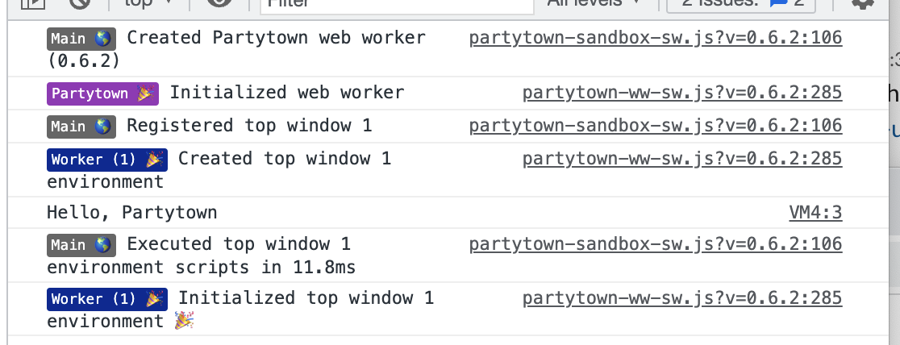
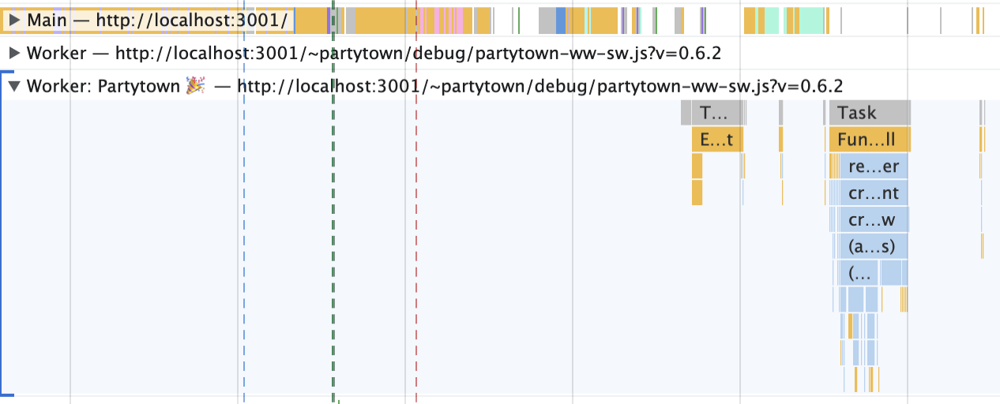

# Partytown Demo
[partytown.builder.io](https://partytown.builder.io/)

>Partytown is a lazy-loaded library to help relocate resource intensive scripts into a web worker, and off of the main thread. Its goal is to help speed up sites by dedicating the main thread to your code, and offloading third-party scripts to a web worker.

## Docs
https://www.raresportan.com/a-short-intro-to-partytown/